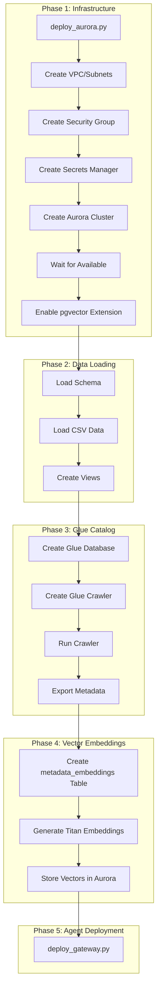
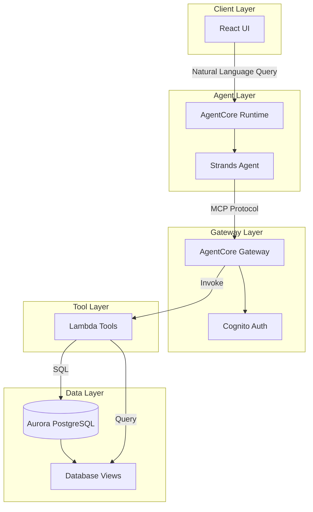
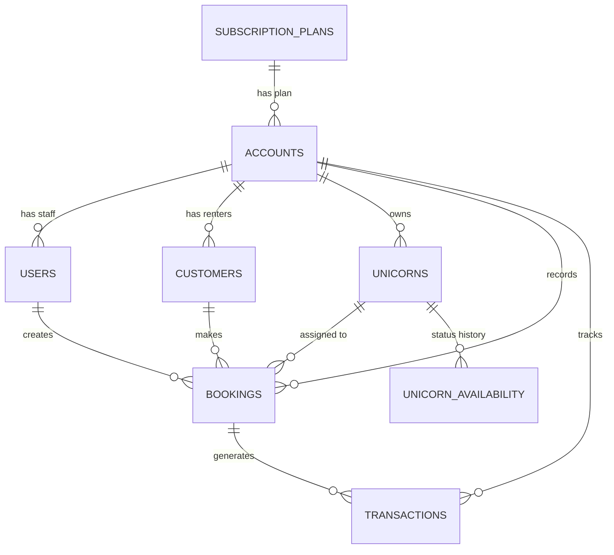

# Design Document: Agentic Analytics

## Overview

The Agentic Analytics system is a natural language business intelligence platform built on AWS services. It enables business users to query their data using conversational language, with an AI agent interpreting queries and orchestrating database tools to return insights.

**Current Implementation Status:** The core system is fully implemented and functional. This design document describes the existing architecture and identifies areas for testing and validation.

The architecture follows a serverless, event-driven pattern:
1. **React UI** sends natural language queries to the backend
2. **AgentCore Runtime** hosts a Strands agent that interprets queries
3. **AgentCore Gateway** provides authenticated MCP access to Lambda tools
4. **Lambda Functions** execute parameterized database queries against Aurora PostgreSQL
5. **Database Views** pre-compute complex analytics for efficient retrieval

### Implementation Status

| Component | Status | Location |
|-----------|--------|----------|
| Strands Agent | ✅ Implemented | `app/agentcore_strands/unicorn_rental_agent.py` |
| Lambda Tools (27+ tools) | ✅ Implemented | `app/agentcore_strands/tools/prebaked_sql_toolset_lambda.py` |
| Create Booking Tool | ✅ Implemented | `app/agentcore_strands/tools/api_integration_toolset_lambda.py` |
| Text-to-SQL Tool | ✅ Implemented | `app/agentcore_strands/tools/custom_sql_toolset_lambda.py` |
| Semantic Search Tool | ✅ Implemented | `app/agentcore_strands/tools/prebaked_sql_toolset_lambda.py` |
| Gateway Deployment | ✅ Implemented | `app/agentcore_strands/infra/deploy_gateway.py` |
| React UI | ✅ Implemented | `app/ui/src/` |
| Chat Interface | ✅ Implemented | `app/ui/src/components/ChatPanel.js` |
| SQL Approval Workflow | ✅ Implemented | `app/ui/src/components/ChatPanel.js` |
| AWS SDK Integration | ✅ Implemented | `app/ui/src/services/awsAgentCore.js` |
| Auth Service | ✅ Implemented | `app/ui/src/services/authService.js` |
| Database Schema | ✅ Implemented | `dataset/schema/schema.sql` |
| Database Views (22 views) | ✅ Implemented | `dataset/schema/schema.sql` |
| Sample Data | ✅ Implemented | `dataset/data/*.csv` |
| Aurora CloudFormation | ✅ Implemented | `infrastructure/aurora-stack.yaml` |
| Glue CloudFormation | ✅ Implemented | `infrastructure/glue-stack.yaml` |
| Master Deployment Script | ✅ Implemented | `infrastructure/deploy_all.sh` |
| Database Initialization | ✅ Implemented | `infrastructure/init_database.py` |
| Glue Table Registration | ✅ Implemented | `infrastructure/register_glue_tables.py` |
| Vector Embeddings | ✅ Implemented | `infrastructure/generate_embeddings.py` |
| Unit Tests | ✅ Implemented | `infrastructure/tests/test_init_database.py`, `test_generate_embeddings.py` |
| Property Tests | ✅ Implemented | `app/agentcore_strands/lambda_tests/test_lambda_properties.py` |
| Integration Tests | ✅ Implemented | `infrastructure/tests/test_integration.py` |

### Infrastructure: Fully Automated

The infrastructure is now fully automated via CloudFormation and deployment scripts:

1. **Aurora PostgreSQL Cluster** - `infrastructure/aurora-stack.yaml` creates Serverless v2 cluster
2. **VPC & Security Groups** - Included in aurora-stack.yaml with private subnets
3. **Secrets Manager Secret** - Auto-generated credentials stored securely
4. **Database Initialization** - `infrastructure/init_database.py` loads schema, data, views
5. **Glue Data Catalog** - `infrastructure/glue-stack.yaml` + `register_glue_tables.py`
6. **Vector Embeddings** - `infrastructure/generate_embeddings.py` with Titan Embeddings

**Deployment Command:**
```bash
cd infrastructure
./deploy_all.sh
```

**Deployment Flow:**


### Vector Embeddings Schema

```sql
-- Enable pgvector extension
CREATE EXTENSION IF NOT EXISTS vector;

-- Metadata embeddings table
CREATE TABLE metadata_embeddings (
    embedding_id UUID PRIMARY KEY DEFAULT gen_random_uuid(),
    metadata_type VARCHAR(50) NOT NULL,  -- 'table', 'column', 'description', 'sample_value'
    source_table VARCHAR(255),
    source_column VARCHAR(255),
    original_text TEXT NOT NULL,
    embedding vector(1536),  -- Titan Embeddings dimension
    created_at TIMESTAMP DEFAULT CURRENT_TIMESTAMP
);

-- Index for similarity search
CREATE INDEX ON metadata_embeddings USING ivfflat (embedding vector_cosine_ops) WITH (lists = 100);
```

### Glue Catalog Integration

Implemented in `infrastructure/register_glue_tables.py`:

```python
# infrastructure/register_glue_tables.py
def register_table(table_name, columns, description):
    """Register a table in Glue Data Catalog with schema"""
    glue_client.create_table(
        DatabaseName=DATABASE_NAME,
        TableInput={
            'Name': table_name,
            'Description': description,
            'StorageDescriptor': {
                'Columns': columns,
                'Location': f's3://{BUCKET}/{table_name}/',
                'InputFormat': 'org.apache.hadoop.mapred.TextInputFormat',
                'OutputFormat': 'org.apache.hadoop.hive.ql.io.HiveIgnoreKeyTextOutputFormat',
            }
        }
    )

def export_catalog_metadata():
    """Export metadata to glue-catalog-metadata.json"""
    tables = glue_client.get_tables(DatabaseName=DATABASE_NAME)
    # Export table schemas, column types, descriptions
    with open('glue-catalog-metadata.json', 'w') as f:
        json.dump(metadata, f, indent=2)
```

### Vector Embedding Generation

Implemented in `infrastructure/generate_embeddings.py`:

```python
# infrastructure/generate_embeddings.py
def generate_embedding(text):
    """Generate embedding using Bedrock Titan Embeddings v2"""
    response = bedrock_client.invoke_model(
        modelId='amazon.titan-embed-text-v2:0',
        body=json.dumps({'inputText': text, 'dimensions': 1024, 'normalize': True})
    )
    return json.loads(response['body'].read())['embedding']

def semantic_search(query: str, top_k: int = 10):
    """
    Find relevant tables/columns using vector similarity.
    Implemented in prebaked_sql_toolset_lambda.py as semantic_search_tool.
    """
    query_embedding = generate_embedding(query)
    # Search metadata_embeddings using cosine distance
    sql = """
    SELECT chunks, metadata, (1 - (embedding <=> %s::vector)) as similarity
    FROM metadata_embeddings
    ORDER BY embedding <=> %s::vector
    LIMIT %s
    """
    return execute_query(sql, [embedding_str, embedding_str, top_k])
```



## Architecture

### Component Responsibilities

| Component | Responsibility |
|-----------|---------------|
| React UI | Chat interface, response rendering, navigation panels |
| AgentCore Runtime | Agent hosting, request routing, streaming support |
| Strands Agent | Query interpretation, tool selection, response generation |
| AgentCore Gateway | Authentication, MCP protocol translation, rate limiting |
| Lambda Tools | Database query execution, response formatting |
| Aurora PostgreSQL | Data persistence, view computation, trigger execution |

### Request Flow

1. User submits natural language query via React UI
2. UI sends request to AgentCore Runtime with prompt and business_id
3. Agent fetches fresh OAuth2 token from Cognito
4. Agent creates MCP client with authenticated transport
5. Agent interprets query and selects appropriate tool(s)
6. Gateway routes tool invocation to Lambda function
7. Lambda executes SQL query and returns structured JSON
8. Agent formats response and streams back to UI
9. UI renders response with markdown formatting

## Components and Interfaces

### Analytics Assistant (Strands Agent)

```python
# Agent Configuration
class AnalyticsAssistant:
    model: BedrockModel  # Claude model for reasoning
    system_prompt: str   # Domain-specific instructions
    tools: List[MCPClient]  # Gateway-connected tools
    
    async def stream_async(prompt: str) -> AsyncIterator[Event]:
        """Process query and stream response events"""
        pass
```

**System Prompt Structure:**
- Platform context (multi-tenant model explanation)
- Demo data description (accounts, unicorns, customers)
- Available tools catalog with descriptions
- Response guidelines (formatting, tool selection hints)

### AgentCore Gateway Client

```python
class GatewayClient:
    gateway_url: str
    client_id: str
    client_secret: str
    user_pool_id: str
    
    def fetch_access_token() -> str:
        """Fetch OAuth2 token via client credentials grant"""
        pass
    
    def create_transport() -> StreamableHTTPTransport:
        """Create authenticated MCP transport"""
        pass
```

### Lambda Tool Handler

```python
def lambda_handler(event: dict, context: LambdaContext) -> dict:
    """
    Route tool invocations to appropriate handlers.
    
    Args:
        event: Contains tool name and arguments
        context: Lambda context with AgentCore metadata
        
    Returns:
        JSON response with statusCode and body
    """
    tool_name = extract_tool_name(event, context)
    arguments = event.get('arguments', {})
    return handlers[tool_name](arguments)
```

### Tool Interface Definitions

Each tool follows a consistent interface:

```python
def tool_handler(args: dict) -> dict:
    """
    Execute database query and return results.
    
    Args:
        args: Tool-specific parameters (account_id, filters, limits)
        
    Returns:
        {
            'statusCode': 200,
            'body': json.dumps({
                'success': True,
                'count': int,  # Number of records
                'data': list   # Query results
            })
        }
    """
    pass
```

### React UI Components

```
SplitScreenLayout
├── ChatPanel          # Natural language input and response display
├── OverviewPanel      # Dashboard summary metrics
├── BookingsPanel      # Booking list and calendar view
├── CustomersPanel     # Customer list and search
├── UnicornsPanel      # Unicorn inventory management
└── RevenuePanel       # Revenue charts and trends
```

## Data Models

### Core Entities



### Entity Schemas

**Account (Tenant)**
```typescript
interface Account {
  account_id: UUID;
  plan_id: UUID;
  account_name: string;
  status: 'active' | 'suspended' | 'terminated';
  billing_email: string;
  current_storage_usage_gb: number;
  current_user_count: number;
  next_billing_date: Date | null;
  created_at: Date;
  updated_at: Date;
}
```

**Unicorn (Asset)**
```typescript
interface Unicorn {
  unicorn_id: UUID;
  account_id: UUID;
  name: string;
  breed: string;
  color: string;
  horn_length_cm: number;
  seat_capacity: number;
  magic_abilities: string;
  hourly_rate: number;
  is_available: boolean;
  is_active: boolean;
  last_service_date: Date | null;
  next_service_due: Date | null;
  created_at: Date;
  updated_at: Date;
}
```

**Customer (Renter)**
```typescript
interface Customer {
  customer_id: UUID;
  account_id: UUID;
  customer_type: 'individual' | 'organization';
  first_name: string;
  last_name: string | null;
  organization_name: string | null;
  email: string;
  phone_number: string | null;
  city: string | null;
  country: string | null;
  created_at: Date;
  updated_at: Date;
}
```

**Booking**
```typescript
interface Booking {
  booking_id: UUID;
  customer_id: UUID;
  unicorn_id: UUID;
  user_id: UUID;
  account_id: UUID;
  booking_reference: string;
  start_datetime: Date;
  end_datetime: Date;
  base_hourly_rate: number;
  total_cost: number;
  is_completed: boolean;
  created_at: Date;
  updated_at: Date;
}
```

**Transaction**
```typescript
interface Transaction {
  transaction_id: UUID;
  customer_id: UUID;
  account_id: UUID;
  booking_id: UUID | null;
  transaction_type: 'booking_fee' | 'subscription' | 'refund' | 'adjustment';
  amount: number;
  currency: string;
  status: 'pending' | 'completed' | 'failed' | 'refunded';
  payment_method: string | null;
  tax_amount: number;
  created_at: Date;
  updated_at: Date;
}
```

### Database Views

| View Name | Purpose | Key Columns |
|-----------|---------|-------------|
| daily_bookings_summary | Bookings with customer/unicorn details | booking_id, customer_name, unicorn_name, total_cost |
| monthly_revenue_summary | Aggregated monthly revenue | year_month, total_revenue, booking_count, avg_booking_value |
| current_unicorn_availability | Real-time unicorn status | unicorn_id, name, is_available, status_reason |
| customer_retention_metrics | Customer segmentation by activity | customer_id, retention_segment, last_booking_date |
| customer_segmentation_by_revenue | Value-based customer tiers | customer_id, revenue_tier, total_revenue |
| top_revenue_unicorn_breeds | Breed performance ranking | breed, total_revenue, booking_count |
| revenue_by_time_and_day | Temporal revenue patterns | day_of_week, hour_of_day, total_revenue |
| unicorns_due_for_maintenance | Maintenance scheduling | unicorn_id, name, maintenance_urgency |


## Correctness Properties

*A property is a characteristic or behavior that should hold true across all valid executions of a system—essentially, a formal statement about what the system should do. Properties serve as the bridge between human-readable specifications and machine-verifiable correctness guarantees.*

### Property 1: Response Emoji-Free

*For any* response generated by the Analytics_Assistant, the response text SHALL NOT contain any emoji characters (Unicode ranges U+1F600-U+1F64F, U+1F300-U+1F5FF, U+1F680-U+1F6FF, U+1F1E0-U+1F1FF, U+2600-U+26FF, U+2700-U+27BF).

**Validates: Requirements 1.4**

### Property 2: Account ID Query Filtering

*For any* Lambda tool that accepts an account_id parameter, when account_id is provided, the executed SQL query SHALL include a WHERE clause filtering by that account_id.

**Validates: Requirements 2.1**

### Property 3: Account ID Data Isolation

*For any* Lambda tool response when account_id is provided, all returned records SHALL have an account_id field matching the requested account_id.

**Validates: Requirements 2.2**

### Property 4: Cross-Account Aggregation

*For any* Lambda tool that supports account_id filtering, when called without an account_id parameter, the results SHALL include records from multiple distinct accounts (when multiple accounts exist in the database).

**Validates: Requirements 2.4**

### Property 5: Top Customers Revenue Ordering

*For any* result set from get_top_revenue_customers_tool, for all consecutive pairs of customers (customer[i], customer[i+1]), customer[i].total_revenue SHALL be greater than or equal to customer[i+1].total_revenue.

**Validates: Requirements 4.2**

### Property 6: Top Breeds Revenue Ordering

*For any* result set from get_top_revenue_breeds_tool, for all consecutive pairs of breeds (breed[i], breed[i+1]), breed[i].total_revenue SHALL be greater than or equal to breed[i+1].total_revenue.

**Validates: Requirements 4.3**

### Property 7: Valid Retention Segments

*For any* customer record returned by get_customer_retention_metrics_tool, the retention_segment field SHALL be one of: 'churned', 'at_risk', 'active', 'new'.

**Validates: Requirements 4.4**

### Property 8: Valid Maintenance Urgency Levels

*For any* unicorn record returned by get_unicorns_due_maintenance_tool, the maintenance_urgency field SHALL be one of: 'overdue', 'due_this_week', 'due_this_month'.

**Validates: Requirements 5.2**

### Property 9: Customer Lifetime Value Consistency

*For any* customer returned by get_customer_lifetime_value_tool, the total_revenue field SHALL equal the sum of all completed transaction amounts for that customer in the transactions table.

**Validates: Requirements 6.1**

### Property 10: Valid Customer Tier Assignments

*For any* customer record returned by get_customer_segmentation_tool, the revenue_tier field SHALL be one of: 'VIP', 'Premium', 'Standard', 'Basic'.

**Validates: Requirements 6.2**

### Property 11: Error Messages Security

*For any* error response from the Analytics_Assistant when authentication fails, the error message SHALL NOT contain: database connection strings, AWS credentials, stack traces, or internal IP addresses.

**Validates: Requirements 7.5**

### Property 12: Availability Trigger Round-Trip

*For any* unicorn, when a new record is inserted into unicorn_availability with status='available', then querying the unicorn's is_available field SHALL return true. Conversely, when status='unavailable' is inserted, is_available SHALL return false.

**Validates: Requirements 9.4**

### Property 13: Streaming Incremental Events

*For any* streaming response from the Analytics_Assistant, the stream SHALL yield at least 2 distinct events before completion (demonstrating incremental delivery rather than single-batch response).

**Validates: Requirements 10.2**

## Error Handling

### Authentication Errors

| Error Condition | Handling Strategy |
|-----------------|-------------------|
| Token fetch fails | Fall back to cached token, log warning |
| Token expired | Refresh token automatically before retry |
| Invalid credentials | Return user-friendly error, no internal details |
| Gateway unreachable | Return connection error with retry suggestion |

### Database Errors

| Error Condition | Handling Strategy |
|-----------------|-------------------|
| Connection timeout | Return 500 with generic database error |
| Query timeout | Return partial results if available, else error |
| Invalid account_id | Return empty result set (not error) |
| Missing required parameter | Return 400 with parameter name |

### Agent Errors

| Error Condition | Handling Strategy |
|-----------------|-------------------|
| Tool not found | Log error, return "unknown tool" message |
| Tool execution fails | Catch exception, return formatted error |
| Streaming interrupted | Yield error event, close stream gracefully |
| Model rate limited | Implement exponential backoff |

### Error Response Format

```python
def error_response(message: str) -> dict:
    return {
        'statusCode': 500,
        'body': json.dumps({
            'success': False,
            'error': message  # User-friendly, no internals
        })
    }
```

## Testing Strategy

### Dual Testing Approach

This system requires both unit tests and property-based tests:

- **Unit tests**: Verify specific tool behaviors, edge cases, and error conditions
- **Property tests**: Verify universal properties across all inputs using randomized testing

### Property-Based Testing Configuration

- **Framework**: Hypothesis (Python) for Lambda tools, fast-check (JavaScript) for React UI
- **Minimum iterations**: 100 per property test
- **Tag format**: `Feature: agentic-analytics, Property {number}: {property_text}`

### Test Categories

#### Lambda Tool Tests

| Test Type | Coverage |
|-----------|----------|
| Unit tests | Each tool handler with specific inputs |
| Property tests | Data isolation, sorting, enum validation |
| Integration tests | End-to-end tool invocation via Gateway |

#### Agent Tests

| Test Type | Coverage |
|-----------|----------|
| Unit tests | Token fetching, transport creation |
| Property tests | Response format validation, streaming behavior |
| Integration tests | Full query processing with mock tools |

#### UI Tests

| Test Type | Coverage |
|-----------|----------|
| Unit tests | Component rendering, state management |
| Property tests | Markdown rendering consistency |
| E2E tests | Full chat flow with mock backend |

### Test Data Strategy

- Use synthetic test database with known data distributions
- Generate random but valid UUIDs, dates, and amounts for property tests
- Maintain test fixtures for specific edge cases
- Isolate tests using transaction rollback or test-specific accounts

### Property Test Implementation Pattern

```python
from hypothesis import given, strategies as st

@given(account_id=st.uuids())
def test_account_id_data_isolation(account_id):
    """
    Feature: agentic-analytics, Property 3: Account ID Data Isolation
    For any Lambda tool response when account_id is provided,
    all returned records SHALL have matching account_id.
    """
    result = get_unicorns({'account_id': str(account_id)})
    body = json.loads(result['body'])
    
    for unicorn in body.get('unicorns', []):
        assert unicorn['account_id'] == str(account_id)
```
