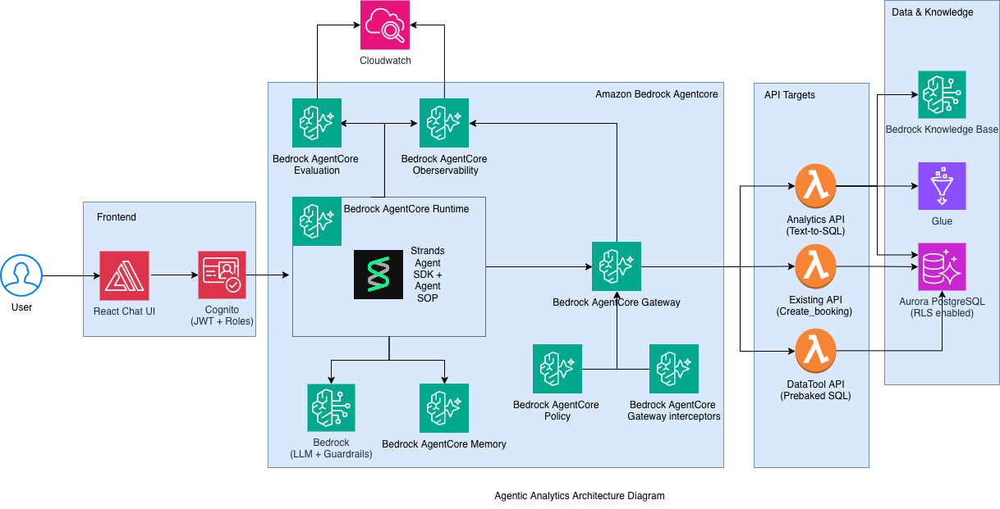

# Agentic Analytics: Self-Service Analytics with Agentic AI on AWS

A reference implementation and [AWS Workshop Studio](https://workshops.aws/) deployable for building AI-powered self-service analytics on multi-tenant SaaS. Business users ask questions in plain English — the AI agent selects the right query, enforces security policies, and returns formatted insights.

Built with [Amazon Bedrock AgentCore](https://docs.aws.amazon.com/bedrock-agentcore/latest/devguide/what-is-bedrock-agentcore.html), [Strands Agents SDK](https://strandsagents.com/latest/), Aurora PostgreSQL, and Cedar policies.

## Architecture



### How It Works

1. **User** asks a question in the React chat UI (e.g., *"Who are my top 3 customers this month?"*)
2. **Cognito** authenticates the user and issues a JWT with tenant (`account_id`) and role (`admin`/`analyst`) claims
3. **AgentCore Runtime** hosts a Strands agent that interprets the query and selects the right tool(s)
4. **MCP Gateway** routes tool calls to Lambda functions, enforcing Cedar RBAC policies and propagating the JWT
5. **Lambda Tools** execute parameterized SQL against Aurora PostgreSQL, with Row-Level Security filtering data by tenant
6. **Agent** formats the results and streams them back to the UI

### Key Components

| Component | Purpose |
|-----------|---------|
| **React UI** | Chat interface with streaming responses and SQL approval workflow |
| **AgentCore Runtime** | Hosts the Strands agent with memory, SOP, and guardrails |
| **MCP Gateway** | Authenticated tool routing with Cedar policy enforcement |
| **Prebaked SQL Toolset** | 27+ analytics tools backed by database Views |
| **API Integration Toolset** | Write operations (e.g., create booking) with tenant-scoped inserts |
| **Custom SQL Toolset** | Text-to-SQL with Glue schema + Bedrock KB RAG + human approval |
| **Aurora PostgreSQL** | Multi-tenant data store with RLS and pgvector for semantic search |
| **Bedrock Knowledge Base** | Business context retrieval for RAG-augmented custom SQL |
| **Cognito** | Authentication with custom claims for tenant and role |
| **CloudWatch + X-Ray** | End-to-end observability via GenAI Observability dashboard |

## Multi-Tenancy: JWT + Row-Level Security

Every request carries a JWT from Cognito containing `custom:account_id` and `custom:role`. The MCP Gateway interceptor propagates this token to each Lambda tool, which extracts the claims and sets PostgreSQL session variables:

```sql
SET app.current_account_id = '<account_id_from_jwt>';
SET app.current_user_role = '<role_from_jwt>';
```

All tables have RLS policies that filter rows by `account_id`, so `SELECT * FROM bookings` automatically returns only the current tenant's data. No application-level filtering needed — the database enforces isolation.

**Pre-Token Lambda V2** enriches the Cognito access token with `custom:role` and `custom:account_id` claims, making them available for both RLS and Cedar policy evaluation.

## Role-Based Access Control: Cedar Policies

The AgentCore Gateway uses a Cedar Policy Engine to control which tools each role can access:

- **Default policy**: All authenticated users can access all read-only analytics tools
- **Role restriction**: Only `admin` users can access write tools (e.g., `create_booking_tool`). Analysts are blocked at the gateway level — the tool is hidden from the agent entirely

When the policy engine is in **ENFORCE** mode, unauthorized tool calls are blocked before reaching the Lambda. In **LOG_ONLY** mode, decisions are logged but all calls are allowed (useful for testing).

## Workshop

This repository is designed as a deployable for **AWS Workshop Studio**. The workshop guides participants through building the system step by step:

| Step | What You Build |
|------|---------------|
| 0 | Environment setup on EC2 Code Editor |
| 1 | Basic local agent (exercise) |
| 2 | Agent infrastructure — Gateway + Runtime |
| 3 | React chat UI connected to AgentCore |
| 4 | Prebaked SQL toolset (27+ analytics tools) |
| 5 | API integration toolset (booking creation) |
| 6 | Custom SQL with Glue + Bedrock KB RAG + human approval |
| 7 | Multi-tenant isolation (Cedar + JWT → PostgreSQL RLS) |
| 8 | Guardrails (topic blocking, PII filtering) |
| 9 | Observability (CloudWatch + X-Ray tracing) |
| 10 | Evaluation (LLM-as-a-Judge with Strands Evals) |

Workshop content is in the [`workshop/`](workshop/) directory. For hands-on instructions, deploy via Workshop Studio or follow the Hugo markdown in `workshop/content/`.

### Workshop Deployment

The workshop uses CloudFormation to pre-provision infrastructure (Aurora, Glue, Bedrock KB, Cognito, EC2 Code Editor). Participants then build the agent layer progressively using code overlays with TODO placeholders. See [`workshop/contentspec.yaml`](workshop/contentspec.yaml) for the Workshop Studio configuration.

## Project Structure

```
├── app/
│   ├── agentcore_strands/       # Strands agent, Lambda tools, deploy scripts
│   │   ├── tools/               # Lambda toolsets (prebaked SQL, API, custom SQL, semantic layer)
│   │   ├── infra/               # Gateway, toolset, and observability deployment
│   │   ├── policy/              # Cedar policy deployment and pre-token Lambda
│   │   ├── guardrails/          # Bedrock Guardrail deployment
│   │   └── evaluation/          # Strands Evals test cases and runner
│   └── ui/                      # React frontend
├── infrastructure/
│   ├── stacks/                  # CloudFormation templates (nested stacks)
│   ├── custom-resource-lambdas/ # Custom Resource Lambda handlers
│   └── scripts/                 # Deployment and utility scripts
├── workshop/
│   ├── content/                 # Workshop guide (Steps 0–10)
│   ├── code/                    # Code overlays with TODO placeholders
│   └── static/images/           # Architecture diagrams
├── dataset/                     # → symlink to unicorn-rental-dataset
├── exercises/                   # Learning exercises (basic_agent.py)
└── common/                      # Shared utilities
```

## The Scenario: Timely-Unicorn

**Timely-Unicorn** is a fictional multi-tenant SaaS platform for unicorn rental businesses. Two rental companies — Mythical Unicorns and Mythic Unicorns — each manage their own fleet of unicorns, customers, bookings, and revenue. The synthetic dataset includes ~14,000 bookings, 500 customers, and 100 unicorns across 3 accounts.

Staff and analysts need answers like *"Who are my top 3 customers this month?"* or *"Create a 3-hour booking for customer X with unicorn Y"* — but they don't know SQL. The AI assistant solves this for all tenants simultaneously, with full data isolation.

## License

This project is licensed under the MIT-0 License. See the [LICENSE](LICENSE) file.

The synthetic dataset (`dataset/`) is licensed under CC0-1.0. See [dataset/LICENSE](dataset/LICENSE).
