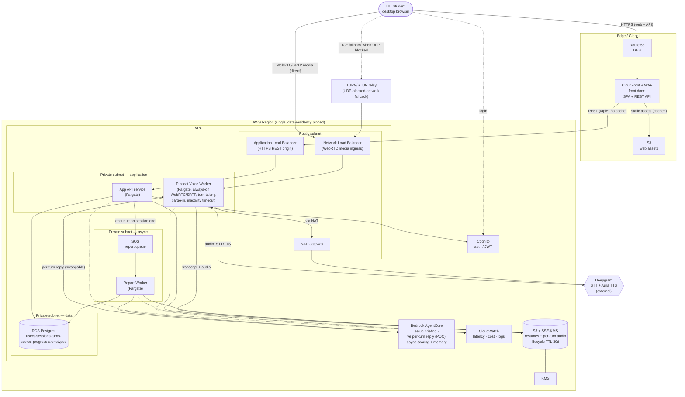
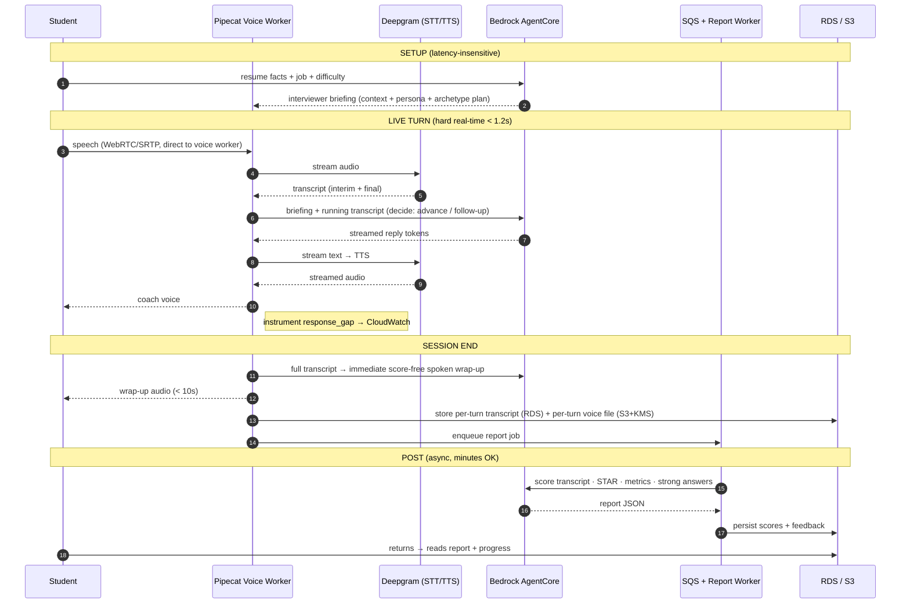

# InterviewCoach — Technical Specification

> **Audience:** Engineering (AI-agent SDLC)
> **V1:** Job-interview scenario · voice-first · desktop web · AWS-native
> **Date:** 2026-06-02

---

## 0. Context & Scope

**In scope (V1 / POC):** Accounts; resume + job ingestion; real-time voice interview with three difficulty levels; immediate qualitative spoken wrap-up; asynchronous written feedback report (scores, per-question breakdown, strong-answer examples, voice metrics); session history + progress chart; audio recording, storage, and playback; consent / encryption / retention / deletion.

**Explicitly deferred:** video recording and facial/body-language analysis; scholarship & admissions scenarios (engine generalizes, not exposed); mobile/responsive; full narrated report (all scores read aloud); under-18 audience and its compliance regime; institutional/teacher dashboard.

**Committed stack (one line):** React web (desktop-first) behind CloudFront (+ WAF) for web + API · Pipecat voice orchestration on ECS Fargate with a direct **WebRTC/SRTP** media path (NLB; TURN fallback) · Deepgram STT + Aura TTS · AWS Bedrock AgentCore (interviewer brain + longitudinal memory + async report + offline question-bank generation) · RDS Postgres (+ **pgvector** for question retrieval) · S3 (SSE-KMS) resumes + per-turn audio · Cognito auth · CloudWatch observability.

---

## 1. Functional Requirements

Cross-referenced to product-spec feature IDs.

| FR | Requirement | Feature |
|---|---|---|
| FR-1 | Users sign up / log in via school email or Google (Cognito); must attest 18+. | A1 |
| FR-2 | System ingests an uploaded resume (PDF/DOCX), extracts structured facts, and displays them for user confirmation before use. Falls back to manual entry on parse failure. **The confirmed resume persists to the user profile and is reused on return with a "still accurate?" confirm.** | A2 |
| FR-3 | System accepts a job title and optional job description as interview context. | A3 |
| FR-2b | **Question engine:** the interview question plan is assembled from a vetted bank of competency-tagged, difficulty-tagged question archetypes; the LLM selects archetypes appropriate to the chosen level and personalizes only the wording to the resume/role. Same competencies are covered across sessions for comparability. | C0 |
| FR-2c | **Bank population (offline, off the hot path):** the archetype bank is **LLM-generated in bulk offline** across a two-axis taxonomy — **General** (cross-role: communication, behavioral/STAR, situational) × **Domain/Industry-specific** (role/industry knowledge) — and each generated archetype passes a **review/approval gate** (status: draft→approved→retired) before it is eligible for live sessions. This is the mechanism behind the "vetted bank." Generation is a deliberate batch job, never per-session. | C0 |
| FR-2d | **Bank retrieval (latency-safe):** at **session creation** (before Start), the plan is assembled by a fast filtered query over (category × industry/role × competency × difficulty) plus a **semantic rank against the job-description embedding** (pgvector) — a millisecond DB query, no live LLM round-trip. The ranked archetype queue is held in memory for the session; resume-wording personalization and opening-question selection happen in this prep window. Only the **dynamic follow-ups (FR-6b)** are generated live, behind the reply seam, during the natural turn gap — so nothing new sits on the response-gap clock (NFR-1). | C0 |
| FR-4 | A pre-interview mic check captures audio, displays a live input level, and has the coach acknowledge a spoken practice line before allowing progression. | B1 |
| FR-5 | User selects Easy / Medium / Hard; the choice deterministically alters interviewer tone, question difficulty, follow-up frequency, and encouragement level. | B2 |
| FR-6 | System conducts a real-time, turn-taking voice interview: streams student audio → STT → interviewer LLM → TTS → audio, with barge-in (interruption) handling and endpointing. | C1 |
| FR-6b | The interviewer generates **dynamic follow-up questions** inline by reasoning over the running transcript (previous questions + answers, already in the live context). Follow-ups are scoped to the **current question's archetype/competency** (depth, not new territory) to preserve cross-session comparability. Follow-up frequency is set by difficulty: Easy = 0, Medium ≈ 1 clarifier, Hard = 2–3 probes that challenge vague answers. | C1b |
| FR-6c | The interviewer runs a **competency-based STAR + funnel methodology**: per archetype it asks an open behavioral question, then probes for the missing STAR element (Situation/Task/**Action**/Result), **probing without leading**, and references back to resume facts + earlier answers. Delivered as a persona prompt template parameterized by job scope, resume highlights, target competencies, the **difficulty profile**, and the current archetype intent — assembled behind the swappable reply seam (Flag F7). | C1c |
| FR-7 | On session end, system generates and plays an immediate **qualitative, score-free** spoken wrap-up from the conversation context. | C2 |
| FR-8 | System produces an asynchronous report with an overall score and four sub-scores: Content/Relevance, Structure (STAR), Communication/Clarity, Confidence (0–10), scored on a **fixed, level-independent rubric** (a score means the same thing at every difficulty). | D1 |
| FR-8b | The report scores **each assessed competency on a fixed 1–5 anchored scale, each backed by a verbatim transcript evidence quote** with the matching STAR element labelled, and widens the communication read to conciseness, hedging/confidence language, and responsiveness under follow-up probes. Computed entirely in the async report worker (no live-latency cost). | D5 |
| FR-9 | For each question, the report shows the student's transcript, what worked, what to improve, and a model strong-answer example **constructed from the student's own resume material arranged into the target structure** (not a generic or fully-scripted answer). | D2 |
| FR-10 | The report includes voice metrics: filler-word count, speaking pace (wpm), and count of long pauses. | D3 |
| FR-11 | System stores session history (date, role, difficulty, scores) and lets the user open any past report. | E1 |
| FR-12 | System renders progress as **two signals**: (a) a difficulty **ladder** (levels reached/cleared) and (b) an **absolute within-level score trend** per sub-score/overall. No difficulty-blended composite score is computed or displayed. | E2 |
| FR-13 | With consent, system stores session audio and supports per-answer playback via short-lived signed URLs. | F1 |
| FR-14 | System enforces explicit consent before first recording; encrypts data at rest/in transit; applies a finite default retention with a "keep" override; supports one-click session delete and full account export/delete. | G1 |

---

## 2. Non-Functional Requirements

| NFR | Target |
|---|---|
| **NFR-1 Latency (live turn)** | Response gap (student stops → coach starts) **p50 < 1.0s, p95 < 1.5s**. Hard release gate at 1.2s p50. Achieved by streaming first-token → TTS, not buffering full responses, over a direct WebRTC media path (no CDN hop; Flag F15). Watch: dynamic follow-ups (FR-6b) make the per-turn LLM reason over a growing transcript — the swappable per-turn path (Flag F7) is the fallback if this pushes the gap past the gate. |
| **NFR-2 Report latency** | Async report ready < 3 min p95; spoken wrap-up plays < 10s after session end. |
| **NFR-3 Cost safety** | Server-side **inactivity timeout** auto-ends a session after ~60–90s of no detected speech (guards stuck-open-mic spend). CloudWatch billing alarms (soft monitoring) otherwise. |
| **NFR-4 Scalability (POC)** | Support concurrent live sessions on horizontally-scalable Fargate voice workers (1 worker ≈ N sessions; scale by task count). Async report jobs queued, scale independently. |
| **NFR-5 Security/Privacy** | TLS in transit for web/API; **DTLS-SRTP** for live media; S3 SSE-KMS at rest; RDS encryption at rest; recordings in a private bucket reachable only via per-user short-lived signed URLs; single-region data residency. WAF at the CloudFront front door covers the web + REST entry paths; the media plane is authenticated by a short-lived per-session join token. |
| **NFR-6 Consent & retention** | No recording without explicit, specific consent. Default retention window finite (configurable; e.g., 30 days) unless user "keeps" a session. Deletion is hard-delete of audio + transcript + scores. |
| **NFR-7 Observability** | Per-turn latency (STT, LLM TTFT, TTS), session duration, cost-per-session, report-job success/duration, error rates — all in CloudWatch. Response-gap is a first-class tracked metric from day one. |
| **NFR-8 Scoring consistency** | Rubric must be stable: the same answer scored repeatedly varies < 0.5 points on the 10-pt scale. Prerequisite for "progress" being real signal. |
| **NFR-9 Availability (POC)** | Best-effort; no formal SLA for POC. Graceful session failure: if the voice loop drops, salvage the partial transcript for a partial report. |
| **NFR-10 Versioning** | Scoring-rubric versions are recorded on each session so cross-session progress comparisons account for rubric changes. |

---

## 3. System Architecture

**Design rule:** split the system by **latency sensitivity**, not by feature. Three regimes — setup (seconds OK), live turns (sub-1.2s), post-session (minutes OK). For the POC, AgentCore is used across all three (AgentCore-first), with the per-turn LLM call placed behind a swappable interface so it can fall back to a lean direct-Bedrock streaming call if the live latency gate (NFR-1) fails.

### 3.1 AWS Deployment Diagram

Single region, single VPC. Public subnet holds only the edge/ingress; all compute and data sit in private subnets. Deepgram is the only off-AWS dependency on the always-on path (external egress via NAT); a managed TURN provider is a second external processor but only for the minority of UDP-blocked sessions that fall back to relay (§3.1.2).



**Key boundaries & decisions encoded above:**
- **Edge (control plane):** Route 53 → CloudFront (+ WAF) fronts the **web + API control plane**: cached static SPA from S3 (`/`) and REST API to the ALB (`/api/*`, no cache). One TLS/WAF/CORS surface for everything a CDN is actually good at, with edge→origin on the AWS backbone.
- **Live media transport (separate media plane):** **WebRTC/SRTP (UDP)** connects the browser **directly** to the Pipecat worker via an NLB — it deliberately **bypasses CloudFront**, because a CDN cannot carry WebRTC media and a real-time audio stream should not take an edge hop anyway. WebRTC is the quality-correct choice: built-in jitter buffer, packet-loss concealment, Opus FEC, and browser AEC/noise-suppression that make barge-in reliable on flaky WiFi (Flag F15). The always-on worker holds the peer connection (hence Fargate, not Lambda). *(Trade-off: WebRTC needs ICE; on networks that block UDP, a managed **TURN relay** provides the fallback path — drawn above.)*
- **External egress:** Deepgram is reached from the private subnet via the NAT Gateway; it is the primary third-party data flow and is called out for the data-processing agreement / privacy review. A managed TURN provider (§3.1.2) is the only other external processor, and only on relayed sessions — included in the same review.
- **Async path:** session-end enqueues to SQS; a separate Report Worker (independent scaling) runs the heavy scoring against AgentCore and writes results to RDS — fully decoupled from the latency-critical voice path.
- **Data protection:** audio in a private, KMS-encrypted S3 bucket with a 30-day lifecycle TTL (FR-14/Q2); RDS in a data-subnet with no public route; everything single-region for residency.

#### 3.1.1 CloudFront behaviors (control plane)

One distribution, two origins, routed by path pattern. The SPA is the only cached content; everything dynamic is pass-through with caching disabled so auth headers and per-user responses are never shared.

| Path pattern | Origin | Cache policy | TTL | Notes |
|---|---|---|---|---|
| `/` , `/assets/*`, `*.js`, `*.css` | S3 (web bucket, OAC) | `CachingOptimized` | long (immutable, content-hashed filenames) | SPA shell + static assets. `index.html` itself served `no-cache` so deploys go live immediately. |
| `/api/*` | ALB (App API) | `CachingDisabled` | 0 | Forward `Authorization`, `Origin`; `OriginRequestPolicy = AllViewerExceptHostHeader`. Cognito JWT validated at the API, not the edge. |
| *(default / SPA routes)* | S3 → `index.html` | `CachingDisabled` for the rewrite | 0 | Custom error response: `403/404 → /index.html (200)` so client-side routing (e.g. `/history`) deep-links work. |

- **Security:** S3 reached only via **Origin Access Control** (bucket is private, no public website endpoint). **WAF** web-ACL attached to the distribution (managed common rules + rate-based rule). TLS 1.2+ via an ACM cert in `us-east-1` (CloudFront requirement); custom domain on Route 53.
- **Not on CloudFront:** the WebRTC media endpoint (NLB) and the TURN relay — they resolve to their own subdomains (e.g. `media.` / `turn.`) and never traverse the distribution.

#### 3.1.2 TURN / STUN provisioning (media plane fallback)

WebRTC establishes the media path via ICE. **STUN** lets the browser discover its public address (works for most home/campus NATs); **TURN** relays the media when a network blocks UDP or uses symmetric NAT — the case WebSocket would have avoided (Flag F15). Expected hit rate: most sessions connect peer-to-NLB directly; only a minority of locked-down corporate/campus networks fall back to TURN.

| Option | What it is | Pros | Cons | POC stance |
|---|---|---|---|---|
| **Managed (recommended)** | Twilio Network Traversal Service / Cloudflare TURN / Xirsys | Zero ops, global edge, pay-per-GB relayed, instant | Per-GB egress cost; a third party briefly relays (encrypted) media | **Use for POC** — avoids running stateful UDP infra while validating the wedge |
| **Self-hosted `coturn`** | `coturn` on EC2 (Elastic IP, UDP 3478 + TLS 5349, relay port range) | Full control, no per-GB markup, media stays in-account (privacy story) | You operate/scale/patch a stateful UDP service; HA is non-trivial | Defer to scale phase, when relay volume makes per-GB pricing the larger cost |

- **Cost driver:** TURN bills on **relayed GB**, and only the fallback minority of sessions relay — so cost scales with *(% UDP-blocked users) × (audio bitrate ~32–64 kbps each way) × minutes*. At Opus voice bitrates this is small per session; the inactivity timeout (NFR-3) also caps relay exposure on abandoned calls.
- **Config delivered to the client:** `POST /sessions` returns `ice_servers` (STUN + short-lived TURN credentials), so credentials are ephemeral and per-session, never baked into the SPA.
- **Privacy note:** a managed TURN provider becomes a transient processor of (DTLS-SRTP-encrypted) media for relayed sessions only — fold it into the same data-processing review as Deepgram. Self-hosting later removes this third party entirely if the privacy posture requires it.

### 3.2 Data Flow (sequence)



**Data flow: input → processing → storage → output**
1. **Input** — student audio (WebRTC/SRTP, direct to the voice worker) + uploaded resume + job text.
2. **Processing (setup)** — resume parsed → structured facts; at session creation the question plan is retrieved from the bank by filtered query + pgvector JD-rank (FR-2d, no live LLM); AgentCore composes the interviewer briefing (context + difficulty persona + the ranked archetype plan).
3. **Processing (live)** — Pipecat streams audio→Deepgram STT→(per-turn LLM)→Deepgram TTS→audio; barge-in + endpointing managed by Pipecat; full transcript accumulated.
4. **Processing (post)** — on session end: immediate spoken wrap-up (warm context, score-free); background job scores transcript, detects STAR, computes voice metrics, generates strong answers.
5. **Storage** — Postgres: `users` (incl. resume S3 path + parsed facts), `interview_sessions` (incl. job scope), `session_turns` (transcript text + per-turn voice S3 path), plus scores/feedback/progress. S3 SSE-KMS: raw resume file + one voice file per turn.
6. **Output** — live coach voice; spoken wrap-up; async written report; progress chart.

### 3.3 Resume & Job-Scope Lifecycle (per session)

How the two personalization inputs are stored and used, end to end:

| Stage | Resume | Job scope (title + description) |
|---|---|---|
| **Capture** | Uploaded once → raw file to **S3**; path + parsed facts on **`users`**. Reused across sessions with a "still accurate?" re-confirm (Q3). | Entered/confirmed per session → stored on **`interview_sessions`**. |
| **Setup (per session)** | App API reads `users.resume_parsed_facts` + the session's job scope from RDS → assembles the **interviewer briefing**. | |
| **Live** | Briefing is passed to AgentCore as **transient session context**; it is *not* persisted in AgentCore. The sub-1.2s loop carries the briefing + running transcript — no per-turn re-fetch. | |
| **Post / Memory** | AgentCore long-term memory (if used) stores only **derived coaching signals** (e.g., "skips Situation in STAR," score-per-competency trends) — never the raw resume or JD. | |
| **Delete** | Account delete → remove `users.resume_uri` S3 object + facts. | Session delete → remove the row (job scope goes with it). |

**Why this split (Flag F14):** RDS + S3 are the single system of record for all raw PII. AgentCore never becomes a second home for it, so one-click delete (FR-14) has a bounded blast radius and a privacy audit has one place to look.

### 3.4 Question-bank generation pipeline (offline — FR-2c/2d)

The archetype bank is built by a **deliberate offline batch job**, completely off the live and
async session paths, so question generation never costs session latency or per-session spend.

```
(operator-triggered batch, not per-session)
  taxonomy seed (category × industry/role × competency × difficulty)
    → Bedrock bulk-generate candidate archetypes (prompt template + follow-up probes + rubric)
      → status = draft
        → review/approval gate (human or rubric-checked) → status = approved | retired
          → embed approved prompt_template (pgvector) → eligible for live selection (FR-2d)
```

- **Generation** runs against Bedrock as a bounded batch (batch size capped to control cost);
  output lands as `QuestionArchetype` rows with `source = generated`, `status = draft`.
- **Review gate (FR-2c):** only `status = approved` archetypes are visible to the session-prep
  retrieval query — this is what "vetted bank" means operationally. Curated/hand-written
  archetypes enter the same table with `source = curated`.
- **Embedding:** approved archetypes are embedded once (offline) so FR-2d's session-prep
  semantic rank against the JD embedding is a pure DB query (pgvector), not an LLM call.
- **Retrieval (session creation):** filter by `category/industry/role/competency/difficulty` +
  pgvector rank → in-memory queue. No live LLM; protects NFR-1.

This pipeline reuses the existing Bedrock dependency and RDS; it adds the **pgvector** extension
and an operator entry point, but no new always-on infrastructure.

---

## 4. Data Models

Primary entities (key fields; not exhaustive):

**Storage split (system of record):** Postgres holds **users, interview sessions, and session turns**. S3 holds the **raw resume file** (path on `users`) and **one voice file per turn** (path on `session_turns`). The job scope lives on the **session**. AgentCore stores none of this durably — it receives resume facts + job scope as transient per-session context only (resolves Flag F14; bounds deletion to RDS rows + S3 objects).

**User** — `id`, `email`, `auth_provider`, `age_attested (bool)`, `consent_recording (bool)`, `consent_recording_at`, `retention_days (default 30)`, **`resume_uri (S3 path, nullable)`**, **`resume_parsed_facts (JSONB, nullable)`**, `resume_confirmed_at`, `role (enum: student|teacher|org_admin — student only in V1)`, `org_id (FK, nullable — V2 hook)`, `created_at`. *(One active resume per user, stored in S3, path here — persists to profile and reused with the "still accurate?" re-confirm, Q3/FR-2.)*

**QuestionArchetype** *(vetted bank — FR-2b/2c/2d)* — `id`, `category (enum: general|domain — FR-2c two-axis taxonomy)`, `competency (enum: teamwork|problem_solving|role_specific|motivation_fit|...)`, `question_type (enum: warmup|behavioral|technical|situational)`, `industry (nullable)`, `role_family (nullable)`, `seniority (nullable)`, `difficulty (enum: easy|medium|hard)`, `prompt_template`, `follow_up_prompts (JSONB — seed probes for the funnel)`, `scoring_rubric (JSONB — anchors for FR-8b)`, `evaluation_hints (JSONB)`, `embedding (vector — pgvector, for FR-2d semantic rank against the JD)`, `source (enum: generated|curated)`, `status (enum: draft|approved|retired — the FR-2c review gate; only 'approved' is eligible for live sessions)`, `version`, `active (bool)`. The interviewer briefing references the selected archetype IDs so a session records *which* competencies/difficulty were assessed (enables cross-session comparability). *(Requires the **pgvector** extension on RDS Postgres.)*

**InterviewSession** — `id`, `user_id (FK)`, **`job_title`**, **`job_description`** *(job scope lives here, captured per session)*, `difficulty (enum: easy|medium|hard)`, `archetype_ids (array)`, `status (enum: in_progress|wrapped|scored|failed)`, `started_at`, `ended_at`, `duration_sec`, `kept_by_user (bool)`, `retention_expires_at`, `rubric_version`, `shared_with_org (bool, default false — V2 hook)`. *(No session-level audio_uri — audio is stored per turn.)*

**SessionTurn** — `id`, `session_id (FK)`, `idx`, `speaker (enum: coach|student)`, **`transcript_text`**, **`audio_uri (S3 path, nullable)`** *(one voice file per turn; null for synthesized coach turns if not retained)*, `t_start_ms`, `t_end_ms`, `archetype_id (FK, nullable)`, `is_followup (bool)`. *(Per-turn audio means playback fetches that turn's file directly — no seek-offset needed.)*

**Org / Cohort** *(V2 hooks, schema present in V1, unused)* — `Org(id, name)`; `Cohort(id, org_id, teacher_user_id, join_code)`; `CohortMembership(cohort_id, student_user_id, share_opt_in bool default false)`. Designed now so the V2 teacher dashboard needs no migration; **no V1 code reads these**.

**Report** — `id`, `session_id (FK)`, `overall`, `score_content`, `score_structure`, `score_communication`, `score_confidence`, `summary_strengths (JSONB)`, `summary_improvements (JSONB)`, `metrics (JSONB: filler_count, wpm, long_pauses, conciseness, hedging_rate, responsiveness — FR-8b widened communication read)`, `competency_scorecard (JSONB — FR-8b: per assessed competency, a 1–5 anchored score + a verbatim transcript evidence quote + the matched STAR element)`, `status`, `generated_at`, `rubric_version`.

**QuestionFeedback** — `id`, `report_id (FK)`, `question_text`, `student_transcript`, `what_worked`, `what_to_improve`, `strong_answer_example`, `q_score`, `star_coverage (JSONB — which of S/T/A/R the answer contained)`, `evidence_quote (verbatim span backing q_score — FR-8b)`, `turn_id (FK → SessionTurn)` *(links to the student turn for direct per-answer audio playback)*.

**DifficultyProfile** *(FR-5 / C1c levers — stored config, one row per level)* — `level (enum: easy|medium|hard)`, `probing_intensity`, `curveball_rate`, `warmth`, `hint_policy`, `domain_depth`, `scoring_strictness`. Injected into the interviewer persona prompt and (for `scoring_strictness`) referenced by the report worker; the headline rubric anchors stay level-independent (Principle II / Q4).

**ProgressPoint** (derivable, or materialized for chart speed) — `user_id`, `session_id`, `taken_at`, `overall`, sub-scores, `difficulty`, `rubric_version`. **Chart queries group/trend by `difficulty`** (within-level trend) and derive the **ladder** from the set of difficulties with ≥1 scored session; no blended cross-difficulty score is stored (FR-12 / Flag F11).

**Key constraints/indexes:** `InterviewSession (user_id, difficulty, started_at)` for the within-level trend and ladder; `SessionTurn (session_id, idx)`; `QuestionArchetype (competency, difficulty, active)` for plan assembly; TTL/cleanup job on `InterviewSession.retention_expires_at` where `kept_by_user = false`.

**Deletion fan-out (FR-14) — bounded blast radius:** deleting a session removes its `SessionTurn` rows + each turn's S3 voice object + `Report` + `QuestionFeedback`. Deleting an account additionally removes the `users.resume_uri` S3 object and all sessions. Because no raw PII is held in AgentCore, deletion never needs to fan out beyond RDS + S3.

---

## 5. API Specifications

All authenticated via Cognito JWT unless noted. Representative endpoints:

| Method | Path | Request | Response | Notes |
|---|---|---|---|---|
| POST | `/sessions` | `{job_title, job_description?, difficulty}` | `{session_id, voice_token, media_endpoint, ice_servers}` | Creates session (job scope stored on the session); uses the resume already on the user profile. Returns an ephemeral WebRTC join token, the media endpoint (NLB), and ICE/TURN server config for the Pipecat worker. |
| PUT | `/me/resume` | multipart file | `{resume_uri, parsed_facts, parse_status}` | Uploads resume to S3, stores path + parsed facts on `users`; returns parse-back for confirmation (FR-2). Replaces any prior resume. |
| WS/RTC | `{ws_url}` | media stream | media stream | The real-time loop (Pipecat ↔ Deepgram ↔ LLM). Out of band of REST. |
| POST | `/sessions/{id}/end` | `{}` | `{wrap_up_audio_url, report_status:"processing"}` | Triggers wrap-up + enqueues report job (FR-7). |
| GET | `/sessions/{id}/report` | — | `{status, report?}` | Poll (or webhook/SSE) until `scored` (FR-8–10). |
| GET | `/sessions` | — | `[{id, job_title, difficulty, overall, started_at}]` | History (FR-11). |
| GET | `/progress` | — | `{points:[{taken_at, overall, sub_scores, difficulty}]}` | Chart series (FR-12). |
| GET | `/sessions/{id}/turns/{turn_id}/audio` | — | `302 → signed S3 URL` | Returns a short-lived signed URL to that turn's voice file (`SessionTurn.audio_uri`), per-user scoped (FR-13, NFR-5). |
| PUT | `/me/consent` | `{recording:bool, retention_days}` | `{ok}` | Consent + retention (FR-14). |
| DELETE | `/sessions/{id}` | — | `{ok}` | Hard-delete audio+transcript+scores (FR-14). |
| DELETE | `/me` | — | `{ok}` | Full account + data deletion (FR-14). |

**Signature flow — the heart of the product (interviewer turn, POC AgentCore path):**
```
student audio chunk
  → Deepgram STT (streaming, interim + final)
  → on endpoint: AgentCore.invoke(session_briefing + running_transcript, stream=true)
        the agent decides per difficulty: advance to next archetype,
        OR ask a follow-up that probes the student's last answer
        within the CURRENT archetype (FR-6b)
  → first tokens → Deepgram Aura TTS (streaming)
  → audio to student
[instrumented: t_stt_final, t_llm_first_token, t_tts_first_audio → response_gap]
[if response_gap p50 > 1.2s over rolling window → flip config to direct-Bedrock per-turn path]
```

---

## 6. Implementation Roadmap

AI-agent SDLC: **capability gates, not calendar dates.** Each gate has a measurable exit criterion (see Executive Summary). Dependency order is what matters.

| Gate | Deliverable | Depends on | Exit criterion |
|---|---|---|---|
| **G1 Voice loop** | Pipecat + Deepgram STT/TTS + LLM streaming turn-taking on Fargate; mic check (FR-4, FR-6) | — | Response-gap p50 < 1.0s, p95 < 1.5s over 10 turns (NFR-1) |
| **G2 Personalization** | Resume parse + parse-back; job input; question bank (offline generation + review gate + pgvector retrieval); STAR+funnel interviewer persona; difficulty profiles (FR-2,2b,2c,2d,3,5,6c) | G1 | Questions reference resume facts; bank serves an approved, JD-ranked plan from DB; E/M/H behaviorally distinct |
| **G3 Report** | Async scoring job; rubric; per-Q feedback; strong answers; voice metrics; evidence-anchored competency scorecard (FR-8,8b,9,10) | G1, G2 | Rubric consistency < 0.5 pt variance (NFR-8); each competency score carries a real transcript quote |
| **G4 Wrap-up bridge** | Score-free spoken wrap-up; processing + return flow (FR-7) | G1, G3 | Wrap-up < 10s post-end; no score contradiction (Flag F6) |
| **G5 Progress** | Accounts, history, progress chart (FR-1,11,12) | G3 | Returning student sees a trend across ≥2 sessions |
| **G6 Privacy** | Consent, encryption, retention TTL, delete/export (FR-13,14) | G1, G5 | Recording gated on consent; delete purges audio+transcript+scores |

---

## 7. Testable Acceptance Criteria

- **AC-1 (FR-4):** *Given* a working mic, *when* the student says the practice line, *then* the coach acknowledges within 1.5s and the "continue" control unlocks; *given* no audio is detected, progression stays blocked with a troubleshooting hint.
- **AC-2 (FR-5 / FR-6b):** *Given* difficulty = Hard, *when* the student gives a vague answer, *then* the interviewer asks a probing follow-up that references something the student actually said; *given* Easy, *then* it does not and offers encouragement.
- **AC-2b (FR-6b):** *Given* any follow-up is asked, *then* it stays within the current question's competency/archetype (does not introduce a new competency), preserving the per-session competency coverage.
- **AC-2c (FR-6c):** *Given* a behavioral answer missing the Action, *when* the coach responds, *then* it asks a probe targeting what the student personally did (funnel for the missing STAR element) without stating or hinting at a model answer.
- **AC-2d (FR-2c/2d):** *Given* a generated archetype in `status = draft`, *when* a session plan is assembled, *then* it is NOT selected; *given* an `approved` archetype matching the job's domain/role/difficulty, *then* session-prep returns a JD-ranked queue from the DB with no live LLM call.
- **AC-3 (FR-6 / NFR-1):** *Given* a live session, *when* measured over 10 turns, *then* response-gap p50 < 1.0s and p95 < 1.5s.
- **AC-4 (FR-7 / Flag F6):** *Given* a completed session, *when* the wrap-up plays, *then* it contains no numeric scores and is delivered within 10s of session end.
- **AC-5 (FR-2):** *Given* a valid PDF resume, *when* uploaded, *then* parsed facts are shown for confirmation; *given* an unparseable file, *then* manual entry is offered without blocking.
- **AC-6 (FR-8 / NFR-8):** *Given* one fixed answer transcript, *when* scored 3 times, *then* overall varies < 0.5 points.
- **AC-7 (FR-9):** *Given* a scored session, *when* the report opens, *then* every question shows transcript + what-worked + what-to-improve + a strong-answer example.
- **AC-7b (FR-8b):** *Given* a scored session, *when* the report opens, *then* each assessed competency shows a 1–5 anchored score accompanied by a verbatim quote from the student's transcript, and the quote is actually present in that session's turns.
- **AC-8 (FR-12):** *Given* a student with ≥2 scored sessions, *when* they open the dashboard, *then* a trend line across sessions is rendered.
- **AC-9 (FR-13 / NFR-5):** *Given* consent, *when* the student plays back a specific answer, *then* that turn's voice file loads via a short-lived signed URL; *without* consent, no per-turn audio is stored.
- **AC-10 (FR-14):** *Given* a delete request, *when* confirmed, *then* the session's turn transcripts (RDS), per-turn voice files (S3), report, and scores are hard-deleted and no longer retrievable; account deletion also removes the resume S3 object. No residual copy remains in AgentCore.
- **AC-11 (NFR-3):** *Given* ~60–90s of no detected speech, *when* the threshold passes, *then* the session auto-ends and billing meters stop.

---

## Appendix — Key Architectural Decisions & Tensions

Every CTO flag raised in review, with rationale and mitigation.

| # | Decision / Tension | Rationale | Mitigation |
|---|---|---|---|
| F1 (retired) | Originally aimed at minors → COPPA/FERPA/parental consent | Audience scoped to 18+ undergrads | Eliminated; under-18 deferred to a deliberately compliance-resourced phase |
| F2 | Real-time voice as the MVP core | It is the non-negotiable "realistic pressure" wedge | Pipecat streaming; first-token→TTS; 1.2s response gap as a release gate (NFR-1) |
| F3 | Stateful product (accounts + longitudinal store) from day one | "Watch yourself improve" is the differentiator | Invest early in rubric consistency (NFR-8) so progress is real signal |
| F4 | Resume/job ingestion pipeline | Personalization grounded in the student's own resume | Parse-back confirmation; graceful manual fallback |
| F5 | Async reports create a "return moment" | Heavy analysis needs no real-time budget | Score-free spoken wrap-up + designed processing/return flow as a re-engagement hook |
| F6 | Spoken wrap-up vs. scored report may contradict | Two different generation passes (impression vs. rubric) | Keep wrap-up qualitative & score-free; all numbers only in the written report |
| F7 | AgentCore in the live voice loop (POC) | Validate the personalized experience on one runtime first | Instrument response-gap; swappable per-turn path falls back to direct Bedrock if NFR-1 fails |
| F8 | Storing raw voice recordings | Enables playback + future voice/video analysis | Explicit consent, SSE-KMS, finite retention, one-click delete, private signed URLs, region pinning |
| F9 | Soft cost monitoring only | User preference for POC; preserves "unlimited practice" feel | Server-side inactivity timeout as a safety valve against stuck-open sessions; billing alarms |
| F10 | AI-agent SDLC | Build velocity via AI coding agents | Risk shifts to verification/integration; every phase ends in a measurable acceptance gate |
| F11 | Cross-difficulty scoring — temptation of an "always-up" adjusted score | A constructed climbing score is motivating | Rejected: it makes the north-star metric ("measurable improvement") unfalsifiable. Use absolute level-independent rubric + difficulty ladder + within-level trend (two honest signals) |
| F12 | Teacher dashboard introduces a multi-party consent problem (chilling effect on private practice) | Teachers are the buyer; a dashboard aids sales | Deferred to V2; org/cohort/opt-in-share schema designed in V1 (no migration). V2 view will be scores/trends-only, student opt-in, no raw audio/transcripts |
| F13 | Dynamic follow-up questions can drift sessions apart, eroding the cross-session comparability that makes progress trustworthy | Free-roaming follow-ups maximize realism | Scope follow-ups to *depth within the current archetype* (not new competencies); archetype bank still anchors main questions; intensity scales with difficulty. Comparability preserved at the archetype level. Also watch the live-latency gate (interacts with F7) |
| F14 | Duplicating raw PII (resume/JD/voice/transcripts) into AgentCore Memory would create a second copy outside the system of record and complicate deletion | AgentCore Memory powers longitudinal personalization | RDS + S3 are the sole system of record; AgentCore receives resume facts/JD as transient per-session context and holds no durable raw PII. Deletion fan-out is bounded to RDS rows + S3 objects (FR-14). Any future AgentCore long-term memory stores only *derived* coaching signals, not raw documents |
| F15 | CloudFront fronts the deployment, but a CDN cannot carry WebRTC media — so "front everything with CloudFront" and "best live-audio quality" appear to conflict | The product thesis is a *realistic conversation*; live-audio quality under real-world WiFi is non-negotiable, yet a single secure front door is still wanted for web + API | **Split the planes.** CloudFront (+ WAF) fronts the web + REST control plane; **WebRTC/SRTP media goes direct** to the Pipecat worker via an NLB, bypassing CloudFront. WebRTC is chosen over WebSocket because its jitter buffer, packet-loss concealment, Opus FEC, and browser AEC keep barge-in reliable under loss — WebSocket/TCP suffers head-of-line blocking and weaker echo cancellation. Residual concern: WebRTC needs UDP, so a managed **TURN relay** is provisioned as the ICE fallback for locked-down campus/corporate networks (the one thing WebSocket would have gotten "for free") |
