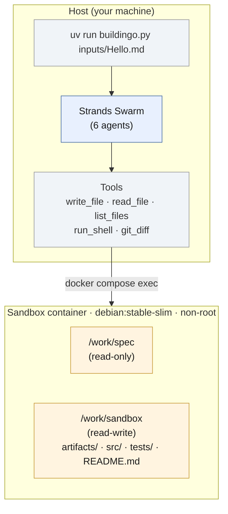
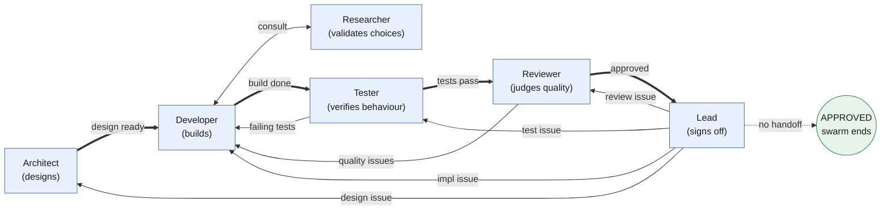

# Isolated agentic coding team

A demonstration of [Strands Agents](https://strandsagents.com/) `Swarm` running on Amazon Bedrock. Six specialised agents collaborate to design, build, test, review, and sign off a complete implementation inside a sandboxed environment.

This project is intended as a learning example for multi-agent orchestration patterns. It is not a production tool.

- Built on Strands Agents `Swarm`.
- Powered by Amazon Bedrock (Claude Opus 4.6 and Sonnet 4.6 by default).
- Bounded by an iteration cap and a configurable cost budget.
- The agents run on the host; their tool calls reach into a long-running, hardened Debian container where they install whatever the build needs.
- Nothing the agents do touches your workstation directly.

> **Only run `buildingo.py` with an input spec you have written or fully reviewed.** The spec is fed to the agents as task input. A malicious or untrusted spec can attempt prompt injection, instruct agents to fetch and run remote code, or steer the build toward exfiltration paths. Treat input specs like code you are about to execute.

## System architecture



## Swarm flow



Thick arrows are the happy path. Thin arrows are sendbacks. The Lead is the only agent that can end the swarm, by not handing off. `max_handoffs` and `max_iterations` enforce the iteration cap; the `repetitive_handoff_detection_window` setting (window=8, min_unique_agents=4) catches stuck loops where the same subset of agents cycle without the Lead or Architect appearing, which is the strongest signal of no progress.

## Agent roles

| Agent | Role | Default model |
|---|---|---|
| **Architect** | Reads the user's spec, refines it into a testable `REQUIREMENTS.md`, then derives `DESIGN.md`. Scales document depth to spec complexity. Entry point of the swarm. | Opus 4.6 |
| **Developer** | Builds against the design. Writes all production code and a user-facing `README.md` for the generated project. Pulls in the Researcher when uncertain. | Sonnet 4.6 |
| **Researcher** | On-demand: validates approach choices (libraries, algorithms, patterns). Reactive only, always hands back to the Developer. | Sonnet 4.6 |
| **Tester** | Independent QA. Runs the suite, walks every acceptance criterion in `REQUIREMENTS.md`, writes missing test coverage. Owns the test files. | Sonnet 4.6 |
| **Reviewer** | Judges code quality, security, design adherence, and README accuracy. Scoped review proportional to project complexity. Tests passing is necessary but not sufficient. | Sonnet 4.6 |
| **Lead** | Final sign-off. Verifies `REQUIREMENTS.md` did not drift from the user's spec, runs end-to-end smoke tests, confirms all artifacts are on disk. The only agent that can end the swarm. | Sonnet 4.6 |

## Generated artifacts

Every run produces these files under `./sandbox/` on the host (volume-mounted from `/work/sandbox/` in the container), so they persist after the container is removed:

- `artifacts/REQUIREMENTS.md`: the Architect's refined, testable elaboration of your input spec, with numbered acceptance criteria.
- `artifacts/DESIGN.md`: the technical design, including a mapping from each acceptance criterion to the design element that satisfies it.
- `artifacts/RESEARCH.md`: the Researcher's log of every technical decision they were asked to validate, with alternatives, sources, and recommendations. Only present if the Developer consulted the Researcher at least once.
- `README.md`: the Developer's user-facing documentation with install, run, and test commands.
- `src/` (or the ecosystem's conventional source directory): production source code.
- `tests/` (or the ecosystem's conventional test location): test files.
- Project metadata (`pyproject.toml`, `go.mod`, `Cargo.toml`, `package.json`, `Makefile`, etc.) at the sandbox root.

## Layout

```
.
├── README.md
├── Dockerfile                 # debian:stable-slim, minimal toolchain, non-root
├── docker-compose.yml         # container hardening (cap_drop, limits, etc.)
├── .env.sample
├── .gitignore
├── buildingo.py               # uv inline-metadata script: tools + swarm + lifecycle
├── prompts/
│   ├── architect.md
│   ├── developer.md
│   ├── researcher.md
│   ├── tester.md
│   ├── reviewer.md
│   └── lead.md
├── inputs/                    # sample input specs
│   ├── Hello.md
│   └── Snake.md
├── logs/                      # per-run audit logs (JSONL)
└── sandbox/                   # agent-generated output (gitignored)
```

## Prerequisites

- macOS or Linux.
- Docker Desktop or Docker Engine with Compose v2 (`docker compose` subcommand).
- [uv](https://docs.astral.sh/uv/) (`brew install uv` or `curl -LsSf https://astral.sh/uv/install.sh | sh`). Python is managed by uv per-script.
- AWS credentials with Amazon Bedrock access in your chosen region. The default AWS profile is used (`~/.aws/credentials` or AWS IAM Identity Center). The default models in `.env.sample` are Claude Opus 4.6 and Claude Sonnet 4.6; both must be enabled in your account in the chosen region. See [Manage access to Amazon Bedrock foundation models](https://docs.aws.amazon.com/bedrock/latest/userguide/model-access.html).

No `pip install`, no virtualenv to manage. uv reads the inline metadata at the top of `buildingo.py` and creates a cached, isolated environment automatically.

### Recommended IAM policy

Scope the credentials `buildingo.py` uses to Bedrock-only. A minimal policy:

```json
{
  "Version": "2012-10-17",
  "Statement": [
    {
      "Effect": "Allow",
      "Action": [
        "bedrock:InvokeModel",
        "bedrock:InvokeModelWithResponseStream",
        "bedrock:Converse",
        "bedrock:ConverseStream"
      ],
      "Resource": [
        "arn:aws:bedrock:*::foundation-model/anthropic.claude-*",
        "arn:aws:bedrock:*:*:inference-profile/*anthropic.claude-*"
      ]
    }
  ]
}
```

Use a dedicated AWS profile (e.g. `AWS_PROFILE=buildingo`) so the orchestrator never has access to anything else on your account.

## Run it

```bash
# 1. Pick your models and region.
cp .env.sample .env
# edit .env if needed

# 2. Make sure AWS creds work for Bedrock.
aws sts get-caller-identity

# 3. Run with one of the sample specs.
uv run buildingo.py inputs/Hello.md
```

What happens:

1. uv reads the `# /// script` block at the top of `buildingo.py`, sets up an isolated env with `strands-agents` and `boto3`, and runs the script.
2. `docker compose up -d --build` brings the sandbox up.
3. The script wipes `./sandbox/` from any previous run (pass `--persist` to keep it), then runs `git init` inside the sandbox and tags the empty state as `iter-0`.
4. The swarm starts at the Architect. The Architect refines the input spec into `REQUIREMENTS.md`, then writes `DESIGN.md` against those requirements, and hands off to the Developer. From there, agents collaborate via handoffs until the Lead signs off (or the iteration cap or cost budget is hit).
5. On approval, the Lead's final message starts with `VERDICT: APPROVED` and includes a summary, key file paths, and the run command.
6. The container stays running so you can `docker compose exec sandbox bash` and inspect. Stop it with `docker compose down`.

### Flags

- `--persist`: skip the sandbox-wipe step and keep output from the previous run.
- `--commentary`: stream each agent's text output as they work (line-buffered).

## Output

Everything the agents produce lands in `./sandbox/` on your machine. This directory is volume-mounted into the container and persists after `docker compose down`. After a successful run you will find:

```
sandbox/
├── artifacts/
│   ├── REQUIREMENTS.md    # refined spec with numbered acceptance criteria
│   ├── DESIGN.md          # technical design and AC-to-code mapping
│   └── RESEARCH.md        # research log (if the researcher was consulted)
├── README.md              # user-facing docs: install, run, test
├── src/                   # production source code
├── tests/                 # test suite
└── (project metadata)     # Cargo.toml, go.mod, package.json, etc.
```

This is your project. `cd sandbox` and use it as you would any other codebase.

The orchestrator also writes a per-run audit log to `./logs/<run-id>.jsonl` recording every `docker compose exec` call (timestamp, command, exit code, output sizes). Useful for forensics if a run produces unexpected output.

## Configuration

All knobs are environment variables. Defaults are in `.env.sample`.

| Variable | Default | Purpose |
|---|---|---|
| `AWS_REGION` | `us-east-1` | Bedrock region. |
| `BUILDINGO_MAX_ITERATIONS` | `3` | Conceptual cycle cap. The swarm's `max_handoffs` and `max_iterations` are set to `10 * this value` to give agents room to consult each other within a cycle. |
| `BUILDINGO_NODE_TIMEOUT_SECONDS` | `300` | Per-agent turn timeout. 10 minutes is generous; anything longer means the agent is stuck. |
| `BUILDINGO_EXECUTION_TIMEOUT_SECONDS` | `3600` | Whole-swarm timeout. |
| `BUILDINGO_MAX_COST_USD` | `20.0` | Cost budget. The swarm aborts if estimated spend exceeds this. Uses worst-case Opus pricing, so actual spend may be lower. |
| `BUILDINGO_MODEL_ARCHITECT` | Claude Opus 4.6 | Deep upfront reasoning for requirements and design. |
| `BUILDINGO_MODEL_DEVELOPER` | Claude Sonnet 4.6 | Most production code; most turns. |
| `BUILDINGO_MODEL_RESEARCHER` | Claude Sonnet 4.6 | Reactive lookups; cost-sensitive. |
| `BUILDINGO_MODEL_TESTER` | Claude Sonnet 4.6 | Mechanical verification. |
| `BUILDINGO_MODEL_REVIEWER` | Claude Sonnet 4.6 | Scoped code review; proportional to complexity. |
| `BUILDINGO_MODEL_LEAD` | Claude Sonnet 4.6 | Decisive sign-off; cost-sensitive. |

## Writing a spec

A good spec is the single biggest determinant of outcome quality. The Lead, Reviewer, and Tester can only judge what is testable.

- Be explicit about acceptance criteria. Frame them as commands and observable outputs (`pytest -q` exits 0, `curl localhost:8080/health` returns `{"ok":true}`).
- State the language, layout, and constraints if they matter. If not, the Architect will pick the best tool for the job.
- Avoid phrases like "the system should be robust"; the Reviewer cannot grade that.
- See the sample specs in `inputs/` (`Hello.md` and `Snake.md`) for working examples.

## How the loop terminates

The swarm ends when the Lead takes the APPROVED path: it produces a final message starting with `VERDICT: APPROVED` and does not call `handoff_to_agent`. Strands sees no handoff and terminates.

If the iteration cap is hit, Strands halts with a non-completed status and the script prints the path. The sandbox still contains whatever the Developer last produced.

If the cost budget (`BUILDINGO_MAX_COST_USD`) is exceeded, the orchestrator aborts the swarm immediately. Workspace state is preserved.

If the swarm starts cycling without progress (typically the Developer-Tester-Reviewer triangle), `repetitive_handoff_detection_window=8` plus `repetitive_handoff_min_unique_agents=4` (set in `build_swarm`) breaks the loop. The detector forces either the Lead or the Architect to appear within any 8-handoff window; if they do not, the swarm bails rather than burn tokens.

## Costs

The default configuration puts only the Architect on Opus and the remaining five agents on Sonnet. Expect:

- Simple spec, single pass (e.g. `Hello.md`): roughly $1.50 to $3.00 per run.
- Medium spec, 1 to 2 rework cycles: $4 to $10 per run.
- Large spec or pathological convergence: $15 or more. The cost budget will abort the run if it exceeds `BUILDINGO_MAX_COST_USD`.

At the end of every run, the script prints a per-agent token usage table with input tokens, output tokens, total tokens, and an estimated USD cost based on on-demand Bedrock pricing, plus a grand total. Example:

```
[buildingo] token usage:

  Agent              Input     Output      Total  Est. cost
  -------------- ---------- ---------- ---------- ----------
  architect          11,350      1,448     12,798    $0.2788
  developer         107,463      3,731    111,194    $0.3784
  tester            205,532      4,959    210,491    $0.6910
  reviewer          148,511      3,074    151,585    $0.4916
  lead               84,546      1,314     85,860    $0.2733
  -------------- ---------- ---------- ---------- ----------
  TOTAL             557,402     14,526    571,928    $2.1132

  Estimated spend: $2.11 USD (approximate; based on on-demand Bedrock pricing)
```

The cost column shows `?` for any agent assigned a model not in the built-in pricing table; update `_PRICING_FAMILIES` in `buildingo.py` if you use custom model IDs.

Cost-down options:

- Move the Architect to Sonnet too if your specs do not require deep upfront reasoning. This makes the entire swarm Sonnet-only.
- Lower `BUILDINGO_MAX_ITERATIONS`.
- Lower `BUILDINGO_MAX_COST_USD` to fail fast on expensive runs.
- Tighten the spec so fewer cycles are needed (the highest-leverage change).

Cost-up options (for complex specs that need deeper reasoning):

- Move the Reviewer to Opus via `BUILDINGO_MODEL_REVIEWER`. Useful when the Developer and Reviewer being on the same model causes correlated drift (rubber-stamping).

## Customising

- **Different language stack inside the sandbox**: the base image is intentionally minimal. The Architect picks the language and the Developer installs the toolchain at runtime via `sudo apt-get install`. If you want a particular toolchain pre-installed, edit `Dockerfile` and `docker compose build sandbox`.
- **More tools for the agents**: add functions in `buildingo.py` decorated with `@tool`, then add them to the relevant `Agent(... tools=[...])`.
- **Fewer agents**: drop the ones you do not need from the `Swarm([...])` call and remove their handoff references from the remaining prompts. Common simplifications: skip the Researcher, skip the Architect (treat the spec as the design), or merge Tester and Reviewer.
- **Different orchestration shape**: if you need explicit conditional routing instead of emergent handoff, switch `Swarm` for `Graph` (see [Strands Graph docs](https://strandsagents.com/docs/user-guide/concepts/multi-agent/graph/index.md)).

## Gotchas

- **Same-model drift.** If you put all six agents on the same model, the Reviewer and Lead will tend to rubber-stamp the Developer. For complex specs, keep at least the Reviewer on a different model from the Developer.
- **Tool output is replayed back into context.** A `run_shell` that produces 200KB of output blows up the next turn. Tools cap output at 50,000 chars; the agent can `grep`, `head`, `tail` to drill in.
- **Reviewer, Tester, and Lead must verify themselves.** It is in the system prompts, but watch for any of them approving based purely on a peer's narrative. If you see this, tighten the relevant prompt.
- **Spec ambiguity dominates failure modes.** Most "looped to max iterations without converging" runs are caused by a spec the agents can interpret two ways. Tight, testable acceptance criteria beat raising the iteration cap.
- **Six agents amplify spec-quality issues.** A vague spec leads to the Architect making questionable choices, the Developer following them, the Tester failing to verify the right things, and the Reviewer and Lead playing whack-a-mole. Time spent on the spec is the highest-leverage time you can spend.

## Security

`buildingo.py` runs AI-generated code inside a container. The container is the security boundary, not the agents' good behaviour. Treat `./sandbox/` output as untrusted until you have reviewed it.

**What is hardened:**

- Container runs as a non-root user (`buildingo`) with passwordless `sudo` only for package installation. A container escape lands as an unprivileged user.
- `cap_drop: ALL` plus only 6 capabilities added back (CHOWN, DAC_OVERRIDE, FOWNER, SETGID, SETUID, NET_RAW).
- `pids_limit`, `mem_limit`, `cpus` set to prevent resource exhaustion on the host.
- Pinned base image by SHA256 digest; pinned Python dependencies (`strands-agents~=1.38`, `boto3~=1.35`).
- `write_file` blocks writes to `.git/hooks/`, `.envrc`, `.vscode/`, `.idea/`, `.devcontainer/` (host auto-execute vectors).
- `.env` loader allowlist only accepts `AWS_REGION` and `BUILDINGO_*` keys, blocking supply-chain attacks via `DOCKER_HOST`, `PATH`, `LD_PRELOAD`, etc.
- Spec is passed as tagged untrusted data, not concatenated into system prompts.
- Sandbox is wiped between runs by default (pass `--persist` to keep previous output).
- Git inside the sandbox uses `core.hooksPath=/dev/null` to prevent hook injection.
- Every `docker compose exec` call is logged to `./logs/<run-id>.jsonl`.

**Known risks (not yet mitigated):**

- **Network egress.** The container has full outbound internet access. A compromised agent can exfiltrate data or fetch malicious payloads. Mitigation: run on an isolated network or add an egress proxy. On Amazon EC2, enforce IMDSv2 with `HttpPutResponseHopLimit=1` to prevent the container from reaching instance metadata.
- **AWS credentials.** The orchestrator uses your default AWS profile. Use a dedicated `buildingo` profile scoped to Bedrock (see the policy above).
- **Tool output injection.** Content fetched by the Researcher (curl, wget) is replayed into agent context without trust boundaries. A poisoned registry README could influence the Developer's choices.
- **Artifact trust laundering.** Downstream agents treat `REQUIREMENTS.md` and `DESIGN.md` as authoritative. A jailbroken Architect could poison these. The Lead compares against the original spec, but this is not a cryptographic guarantee.

**Recommendations:**

- Only run `buildingo.py` with an input spec you have written or reviewed yourself.
- Use the IAM policy above with a dedicated AWS profile.
- Review `./sandbox/` output before opening it in an editor or running any scripts from it.
- Inspect `./logs/<run-id>.jsonl` after each run for unexpected commands.

## Stopping and cleanup

```bash
docker compose down                        # stop and remove the sandbox container
rm -rf sandbox/* sandbox/.[!.]*            # wipe the sandbox output on the host
docker compose down --rmi local            # also remove the image
```

## Licence

This project is licensed under the [MIT License](LICENSE).
