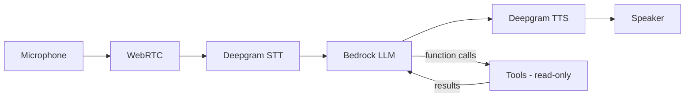

# Voice: voice pair debugger for AWS

`Voice` is a voice-driven AI agent that helps developers debug AWS applications through conversation.
You run it, open a browser tab, and talk to it. `Voice` listens, reasons with a model on Amazon Bedrock, inspects your live AWS resources and local source, then narrates the root cause and the suggested fix.

It is built with [Pipecat](https://github.com/pipecat-ai/pipecat) for the real-time voice pipeline, Deepgram for speech-to-text and text-to-speech, and Amazon Bedrock (Claude) for reasoning and tool use.

`Voice` is read-only by design. It diagnoses and suggests; it never modifies your files or your AWS resources.

## How it works



The model has five tools available:

| Tool                       | Purpose                                  | AWS API                           |
| -------------------------- | ---------------------------------------- | --------------------------------- |
| `query_cloudwatch_logs`    | Search recent logs for a log group       | `logs:FilterLogEvents`            |
| `get_xray_trace_summaries` | Find recent traces with errors or faults | `xray:GetTraceSummaries`          |
| `describe_lambda_function` | Read a function's config and environment  | `lambda:GetFunctionConfiguration`  |
| `read_file`                 | Read a file from the local project        | local, none                       |
| `list_files`                | List files in the project tree            | local, none                       |

See [architecture.md](architecture.md) for the full design, diagrams, and component breakdown.

## Prerequisites

- Python 3.11+
- [uv](https://docs.astral.sh/uv/) for dependency management
- A Deepgram API key
- AWS credentials, with read-only access to the resources you want to debug
- Amazon Bedrock model access enabled for your chosen model in your region

## Setup

```bash
uv sync
cp .env.example .env
# then edit .env and set DEEPGRAM_API_KEY (and AWS settings if needed)
```

## Running

```bash
uv run bot.py
```

Then open `http://localhost:7860/client` in your browser, grant microphone permission, and start talking. The terminal shows the conversation transcript and logs.

To target a specific AWS region or profile, set the standard AWS environment variables:

```bash
AWS_REGION=ap-southeast-2 AWS_PROFILE=my-profile uv run bot.py
```

## Try it with the included sample app

The `sample-app/` directory contains a Terraform stack that stands up a small, deliberately broken application so you can see `Voice` work end to end:
- a DynamoDB table,
- five Lambda functions behind an HTTP API Gateway,
- with X-Ray tracing and CloudWatch logging already enabled.

The stack ships with four planted bugs of increasing difficulty, each surfacing through a different tool (logs, Lambda config, IAM correlation). `GET /users` is the simplest; `DELETE /users/{id}` is the hardest because the code is correct and the fault is in the IAM policy. The full answer key, with symptoms, reproduction steps, and fixes, is in [bugs.md](bugs.md).

```bash
cd sample-app
terraform init
terraform apply
```

Invoke the endpoints to generate some failing requests, then run `Voice` and describe a symptom.

Run `terraform destroy` when you are done.

## Running against existing infrastructure

`Voice` works against any account, but two of its tools depend on telemetry being switched on in the target infrastructure/account. The local file tools and `describe_lambda_function` work with no setup. `query_cloudwatch_logs` and `get_xray_trace_summaries` only return data if logging and tracing are enabled.

There are two distinct things to arrange:
- the data sources in the target infra,
- and the IAM permissions for whoever runs `Voice`.

### Checklist

1. Enable active X-Ray tracing on the Lambdas you want to debug (tracing config plus the `AWSXRayDaemonWriteAccess` permission on the execution role). Off by default.
2. Enable API Gateway access logging if you want `Voice` to see request-level failures at the edge. Off by default. Note that HTTP APIs do not emit X-Ray segments, so trace coverage starts at the Lambda, not the edge.
3. Grant the identity that runs `Voice` the read-only permissions below.
4. Run `Voice` against the right account by setting `AWS_REGION` / `AWS_PROFILE` (or your usual AWS credential environment), and have the project source checked out locally so the file tools can correlate code with symptoms.

Lambda log groups (`/aws/lambda/<function>`) are created automatically on first invocation, so logging for Lambda is usually already in place. The real work for an existing app is items 1 and 2; the rest is credentials.

### Minimum IAM permissions

`Voice` uses the standard boto3 credential chain, so whatever identity `aws sts get-caller-identity` resolves to needs read-only access to the three services the tools call:

```json
{
  "Version": "2012-10-17",
  "Statement": [
    {
      "Effect": "Allow",
      "Action": [
        "logs:FilterLogEvents",
        "logs:DescribeLogGroups",
        "lambda:GetFunctionConfiguration",
        "xray:GetTraceSummaries"
      ],
      "Resource": "*"
    }
  ]
}
```

Scope `Resource` down to specific log groups and functions for least privilege.
The AWS managed policies `CloudWatchLogsReadOnlyAccess` and `AWSXRayReadOnlyAccess`, plus a Lambda read grant, are an equivalent off-the-shelf option. `Voice` never writes, so no write permissions are required.

## Configuration

All configuration is via environment variables, loaded from `.env`. See [.env.example](.env.example).

| Variable             | Required | Default                          | Notes                              |
| -------------------- | -------- | -------------------------------- | ---------------------------------- |
| `DEEPGRAM_API_KEY`   | Yes      | none                             | Deepgram STT and TTS               |
| `AWS_REGION`         | No       | `us-east-1`                      | Target region                      |
| `AWS_PROFILE`        | No       | none                             | Named profile from `~/.aws/config`   |
| `BEDROCK_MODEL_ID`   | No       | `us.anthropic.claude-sonnet-4-6` | Bedrock model or inference profile  |
| `DEEPGRAM_TTS_VOICE` | No       | `aura-2-draco-en`                | Deepgram Aura-2 voice              |

## Security

- `Voice` is strictly read-only. It calls describe and query APIs, reads local files within the working directory, and never mutates AWS resources or your code.
- The local file tools are sandboxed to the current working directory and reject paths that resolve outside it.
- Use a least-privilege, read-only IAM identity as shown above.

## Licence

This project is licensed under the [MIT License](LICENSE).
