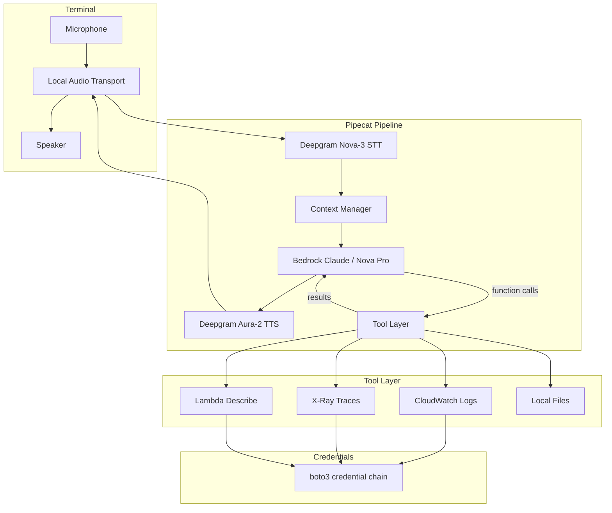
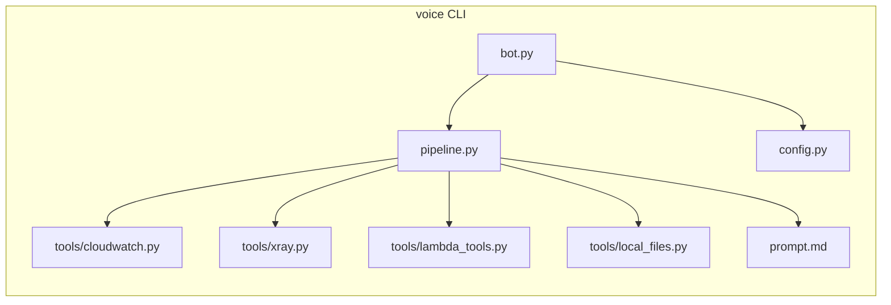
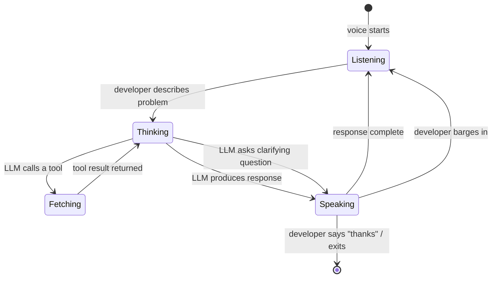

# Voice: voice pair debugger

A voice-driven AI agent that helps developers debug AWS applications through
Socratic conversation. Built with Pipecat, Deepgram, and Amazon Bedrock.

## Name candidates

| Name  | Rationale                                      |
|-------|------------------------------------------------|
| Voice   | Voice. Short CLI command. Memorable.           |
| Hunch | What a debugger forms. `hunch listen`.         |
| Rubi  | Rubber duck debugging, but alive.              |
| Pulse | Monitoring/diagnostics feel. `pulse`.          |

Working name: **Voice**.

## How it works

```mermaid
sequenceDiagram
    participant Dev as Developer (terminal)
    participant Voice as Voice CLI
    participant DG as Deepgram (STT/TTS)
    participant LLM as Bedrock (Claude)
    participant AWS as AWS APIs (boto3)

    Dev->>Voice: runs `voice`
    Voice->>Dev: "What are you seeing?" (audio)
    Dev->>Voice: describes problem (voice)
    Voice->>DG: audio stream
    DG->>Voice: transcription
    Voice->>LLM: transcript + system prompt
    LLM->>Voice: hypothesis + tool call (query_cloudwatch_logs)
    Voice->>AWS: CloudWatch filter_log_events query
    AWS->>Voice: log results
    Voice->>LLM: tool result
    LLM->>Voice: narration + clarifying question
    Voice->>DG: text for TTS
    DG->>Dev: "I see a NullPointerException in... did you expect X?"
    Dev->>Voice: answers (voice)
    Note over Voice,LLM: Loop until root cause identified
    LLM->>Voice: root cause + suggested fix (text)
    Voice->>Dev: narrates fix (audio); transcript shown in terminal
```

## Architecture



## Design decisions

### Audio access

Pipecat does not have a local audio transport that captures the microphone
directly. Instead, Pipecat's **development runner** serves a web UI at
`http://localhost:7860/client` that connects to the bot over WebRTC
(SmallWebRTC). The developer opens the browser tab, grants mic permission,
and speaks. Audio flows over a local WebRTC connection with sub-millisecond
network latency.

For local use this is the simplest path: open a browser tab and talk. Running
`uv run bot.py` starts the server and could auto-open the browser tab.

**Alternative for a CLI-native feel**: wrap the Pipecat dev runner in a
terminal command that also opens the browser. The developer still speaks into
the browser, while the terminal shows the conversation transcript and log
output.

### AWS credentials

Voice uses **boto3** directly. Credentials come from the standard chain:

1. Environment variables (`AWS_ACCESS_KEY_ID`, etc.)
2. `~/.aws/credentials` / `~/.aws/config` (profiles)
3. Instance profile / container credentials

No special setup. If the developer can run `aws sts get-caller-identity`, Voice
can access the same resources. The system prompt instructs the LLM to ask which
region/account to target if ambiguous.

### AWS access method

**boto3 inside Pipecat tools**, not shelling out to the AWS CLI.

Reasons:
- Structured responses (no output parsing)
- Faster (no subprocess overhead)
- Easier error handling
- Can stream results back to the LLM mid-conversation

### Does Voice write code?

**No.** Voice narrates the root cause and suggests where/what to
change. It describes the change while speaking; the conversation transcript
appears in the terminal.

**Future:** could write a patch file, open a PR, or apply changes via an editor
integration. Out of scope for now.

### CLI interface

```
uv run bot.py    # start server, open browser at localhost:7860/client
```

Region and profile come from the environment (`AWS_REGION`, `AWS_PROFILE`) or
`.env`, read by `config.py`. The developer runs `uv run bot.py`, a browser tab
opens for mic/speaker access via WebRTC, and the terminal shows the conversation
transcript and logs.

## Component breakdown



### Files

| File                    | Purpose                                          |
|-------------------------|--------------------------------------------------|
| `bot.py`                | Entry point: builds the transport and starts the runner |
| `pipeline.py`           | Pipecat pipeline assembly, loads the system prompt |
| `config.py`              | Settings (region, profile, model, voice)          |
| `prompt.md`             | System prompt for the debugging persona          |
| `tools/__init__.py`     | Tool registry and schema builder                 |
| `tools/cloudwatch.py`   | query_cloudwatch_logs                            |
| `tools/xray.py`         | get_xray_trace_summaries                         |
| `tools/lambda_tools.py` | describe_lambda_function                         |
| `tools/local_files.py`   | read_file, list_files                              |

## Interaction model



The developer can interrupt (barge-in) at any time. Pipecat + Deepgram handle
turn detection and barge-in natively.

## Tech stack

| Layer         | Technology                      | Notes                        |
|---------------|---------------------------------|------------------------------|
| Orchestration | Pipecat 1.x                     | Pipeline + function calling  |
| STT           | Deepgram Nova-3                 | Real-time streaming          |
| TTS           | Deepgram Aura-2                 | Low-latency synthesis        |
| LLM           | Amazon Bedrock (Claude Sonnet)  | Tool use, streaming          |
| AWS access    | boto3                           | Standard credential chain    |
| Audio         | SmallWebRTC (browser tab)       | localhost:7860/client        |
| Language      | Python 3.11+                    |                              |

## Example session

1. A bug exists: a Lambda function reads from DynamoDB but uses the wrong
   key attribute name. It returns 500 on the `/users` endpoint.
2. Developer runs `voice`.
3. Voice: "What are you seeing?"
4. Developer: "My /users API is returning 500 errors."
5. Voice fetches CloudWatch logs for the API Gateway + Lambda.
6. Voice: "I see an error about a missing 'userId' attribute in the Lambda. The
   DynamoDB table uses 'user_id' as the partition key. Did you recently rename
   that attribute?"
7. Developer: "Oh, I refactored the model yesterday."
8. Voice: "That's the issue. In `get_users.mjs`, change `item.userId` to
   `item.user_id`." (spoken; the transcript shows in the terminal)
9. Done in under 90 seconds. Fully voice-driven.

## Planted bugs

The demo stack ships with four deliberate bugs for Voice to diagnose, each
surfacing through a different tool and with its root cause in a different place
(Lambda code, a code-vs-route mismatch, Lambda config, and the IAM policy). The
source is intentionally free of "this is the bug" comments so they are realistic
to find.

The full answer key, with symptoms, reproduction steps, and fixes, is in
[bugs.md](bugs.md).
